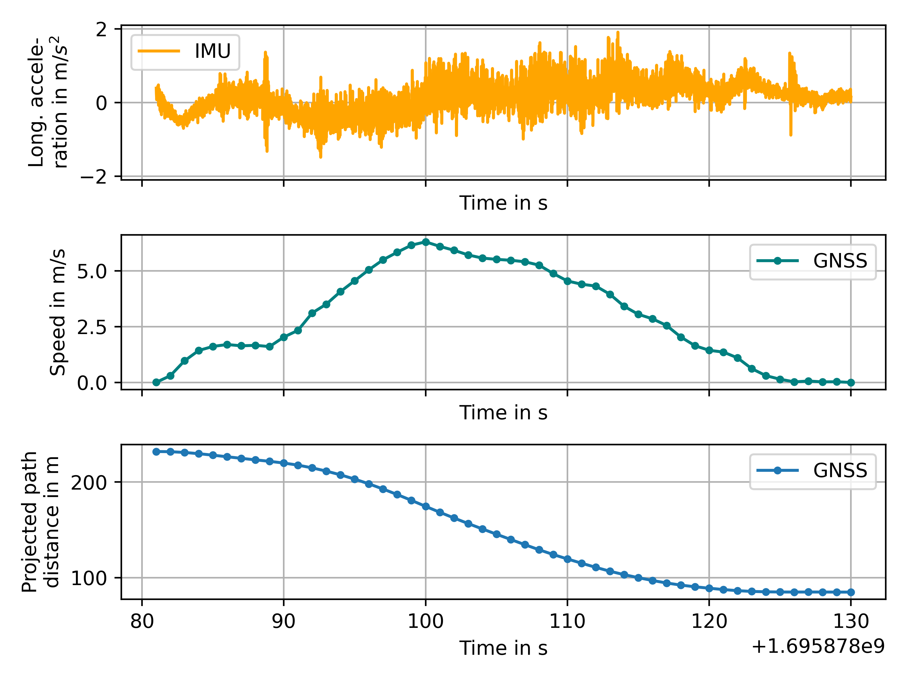
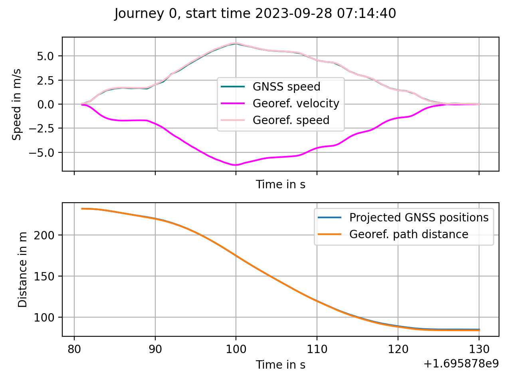
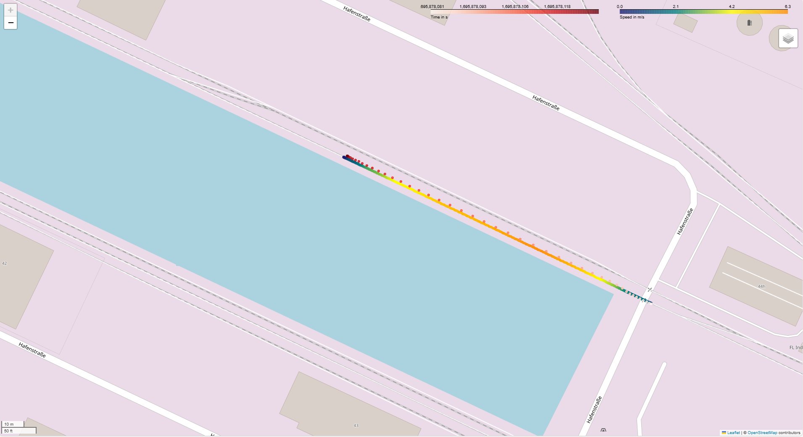

# railpos-onboardeu


***


## Name
railpos-onboardeu.

## Description

This project provides tools for railway vehicle positioning. The software was used to generate offline motion and position information of multiple trams in various European cities within the mFUND project OnboardEU. The repository consists of two modules: a general positioning module named `railpos` and a project-specific module called `onboardeu`. The former contains general functionalities for rail vehicle positioning; the latter contains project and data specific helper functions together with an example notebook to demonstrate the usage of the software. The example notebook is provided [here](https://github.com/DLR-TS/railpos-onboardeu/blob/main/onboardeu/onboardeu_001_example.ipynb). The software was published together with open source data which is available here (add link). Theoretical background can be found in this [publication](https://doi.org/10.23919/ICIF.2018.8455377). The positioning pipeline mainly consists of the following steps: First, a railway path for the data is selected. Second, an on-path Kalman filter (and smoother) is applied. Finally, the output is calculated. It contains speed and velocity, travelled distances with respect to the path, track identifiers and track distances referring to the utilised railway network as well as absolute positions (longitude and latitude).

The `railpos` core module is currently being further developed [here](https://github.com/DLR-TS/railpos).


## Installation

To use the files from this repository clone it to a local folder via:

```git clone https://github.com/DLR-TS/railpos-onboardeu.git``` 

Put the files containing the sensor data (link to `hdf5` file) and the railway network geometries (link to `gpkg` file) into the data folder of the repository.

## Installing dependencies

If you are using `conda` to manage your Python environments (recommmended, preferrably via the much faster [`mamba`](https://mamba.readthedocs.io/en/latest/index.html)), create a new conda environment and install the required dependencies by running the following in the package root folder:
```shell
conda create -n railpos --file requirements.txt
conda activate railpos
```

Otherwise you can use `pip` to install the dependencies:
```shell
python -m pip install -r requirements.txt
```

The code was tested with Python 3.12 and 3.13.

## Usage
The software is intended to be used to calculate positions and motion information of a railway vehicle in a railway network. In this setting, GNSS and IMU data as well as track geometries of a railway network are required. If the pipeline of the [notebook](https://github.com/DLR-TS/railpos-onboardeu/blob/main/onboardeu/onboardeu_001_example.ipynb) is followed, the user will obtain track-selective positions and velocity information. The following two figures exemplarily illustrate the input data (IMU longitudinal acceleration, GNSS speed and positions projected to the path) as well as the output velocity, speed and path distances in comparison with the GNSS input speed and projected path distances for the first journey of the provided data. Finally, Figure 3 shows the input GNSS positions together with the output positions and speeds on the map. Corresponding figures for all journeys of the published data and html files containing the input and output data on a map can be obtained via [add link].
<figure>

<figcaption><b>Figure 1:</b> Input data to the positioning pipeline.</figcaption>
</figure>
<figure>

<figcaption><b>Figure 2:</b> Output speed, velocity and path distances together with the input GNSS data.</figcaption>
</figure>

<figure>

<figcaption><b>Figure 3:</b> Input GNSS positions and timestamps (colormap corresponding to the timestamps in red) together with output positions and speed.</figcaption>
</figure>


## Support
For support contact opensource-ts(at)dlr.de.

## Roadmap
This repository is tailored to the result generation for the project OnboardEU. No further development is planned for this repository. The core module `railpos` of this repository is currently under further development and will be updated with new functionalities. It can be found [here](https://github.com/DLR-TS/railpos).


## Contributing
In the near future, contributions can be made to [`railpos`](https://github.com/DLR-TS/railpos). Details can be found in the respective repository.


## Authors and acknowledgment
In alphabetical order: Erik Hedberg, Judith Heusel, Keivan Kiyanfar, Michael Roth.

All contributions were made during DLR employment of the respective authors. 

## License
This software is released under the 3-Clause BSD License.

